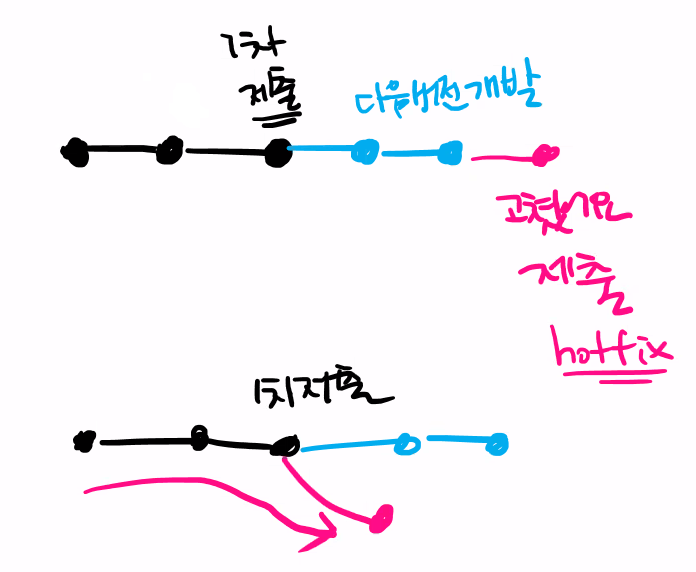

# Branch

## git ignore

- 폴더는 [폴더명]/

- vi 문서편집 명령어 저장은 esc:wq


## GitHub Pages

- 깃허브에 로컬 통해서 새로운 파일 등록시 pull해야하는 이유
  - 버전이 서로 다르므로(commit이 다르다)
  - 깃 허브에 저장되는 파일은 모드 커밋으로 저장된다
  - 커밋을  일자로 올라가는 형태
  - 다른사람과 협업시 가지치기 하며 올라가는 형태
  - 로컬과 원격이 커밋이 다른경우 예시

```bash
$ git push
To https://github.com/rhyou10/test.git
 ! [rejected]        main -> main (fetch first)
error: failed to push some refs to 'https://github.com/rhyou10/test.git'
#원격 저장소 작업!=로컬 저장소 작업
#커밋이
hint: Updates were rejected because the remote contains work that you do
hint: not have locally. This is usually caused by another repository pushing
hint: to the same ref. You may want to first integrate the remote changes
#먼저 원격저장소 변경사항을 
hint: (e.g., 'git pull ...') before pushing again.
hint: See the 'Note about fast-forwards' in 'git push --help' for details.
```

- 매번 반복하기 힘들어(다중사용자일떄)  GitHub Flow 가 생김

- commit vs 로 하고싶을때 (**git commit --edit**)


## Branch

- 버전의 혼합
- 개발중 버그픽스할떄 필요(기존 내용과 개발된 내용이 혼합되지 않기위해)
- 기존내용만 픽스 할때
- 독립된 작업공간이 보장되게 한다



### branch 생성

```bash
$ git branch 브랜치이름
```

### branch 이동

```bash
$ git checkout 브랜치 이름
```

### branch 생성 및 이동

```bash
$ git checkout -b 브랜치 이름
```

### branch 조회

```bash
$ git branch
```

### branch 삭제

```bash
$ git branch -d 브렌치명
```


### brangh merge

```bash
(master) $ git merge 브랜치이름 
```

- master로 병합하려는 경우 master 브랜치에서 명령어를 작성해야함
- `브랜치이름` 을 해당 브랜치로 병합하는 명령어 이기 떄문

### 브랜치 병합 시나리오

- 보고서/ 발표자료 제출

|               a                |               b                |                           시나리오                           |
| :----------------------------: | :----------------------------: | :----------------------------------------------------------: |
|        보고서 발표 자료        |               x                |                           브렌치1                            |
|             보고서             |            발표자료            |                           브렌치2                            |
| 보고서(자료)<br />발표자료(앞) | 보고서(내용)<br />발표자료(뒤) | 브렌치 2인데 파일이 서로 곂침<br />conflict 확인 후 commit 직접 |

## Fork

shared와 fork 가있다

- shared는 push 권한 있다
- fork는 shared 되어있지 않아 fork 를 쓴다
- 즉 fork는 허가되어있지 않은, github의 내용을 가지고 오는것
- push를 하면 상대방에게 허가를 매번 받아야 한다


##  Fetch

- add 취소 명령어 git restore --staged `파일명`

- git restore `파일명` 이전 커밋상태로 되돌린다(다시 현재커밋으로 돌아오는거 불가능)
- git commit --amend 커밋 수정(수정하면 다른커밋이 된다)
- 커밋은 웬만하면 수정하지마라
- commit을 지워버리는 명령어 reset --hard 커밋번호 --> git log에 안남는다 그냥지우는거
  - git revert 커밋번호 -->  히스토리에 남는다(git log) --> 되돌리는거 이거를 추천한다


## git stash

- 잠시 보관하는곳
- 꺼내오는 법 git stash pop
- 모든 커밋시점은 복원이 가능. 되돌리기 가능
- 그래서 일반적으로 모든 작업을 할 떄에는 커밋하면서 이어나감
- 근데 간혹 작업을 하던중 어떠한것을 반영해야할때(pull 해야할떄)
- 이때 필요한게 stash
- 임시공간에 보관 -> pull -> 팝

~~~bash
git stash
git pull
gti stash pop
~~~

- git log --oneline 로그 한라인으로
- 다중사용자일떄 꼭 푸쉬시 브렌치 지정할것


## 참고

- 카카오 기술블로그 참고하는거 좋은습관
- 네이버 deview
- 듀랑고 번역버전관리법-youtube
- velog 개발 내용 참고
- [git참고책](https://git-scm.com/book/ko/v2)
- [gitignore쉽게](https://www.toptal.com/developers/gitignore)
- pep8을 통해 코딩문법(코딩문법은 일정하게)
- 수업 링크들

| 외부 문서          |                                                             | 공유 자료       |                                                         |
| ------------------ | ----------------------------------------------------------- | --------------- | ------------------------------------------------------- |
| 개발자 수준        | https://d2.naver.com/news/3435170                           | README 예시     |                                                         |
| tech writer        | https://developers.google.com/tech-writing                  | 개발자 기술면접 | https://github.com/gyoogle/tech-interview-for-developer |
| Git linus torvalds | https://www.youtube.com/watch?v=4XpnKHJAok8                 |                 | https://github.com/tensorflow/tensorflow                |
|                    | https://brunch.co.kr/@kakao-it/38                           |                 | https://github.com/krta2/awesome-nonsan                 |
| 좋은 커밋메시지    | https://meetup.toast.com/posts/106                          | TIL 예시        |                                                         |
| 커밋 메시지        | https://blog.ull.im/engineering/2019/03/10/logs-on-git.html |                 | https://github.com/wonism/TIL                           |
| gitignore          | https://gitignore.io/                                       |                 | https://github.com/namjunemy/TIL                        |
| git                | https://git-scm.com/book/ko/v2                              |                 | https://github.com/ksu3101/TIL                          |
|                    | https://if.kakao.com/                                       | 포트폴리오      | https://startbootstrap.com/                             |
|                    | https://deview.kr/2021/cfs                                  |                 |                                                         |
|                    | https://tech.kakao.com/blog/                                |                 |                                                         |


