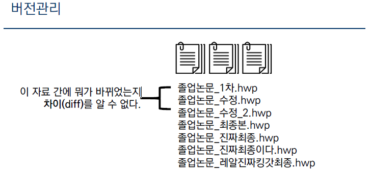
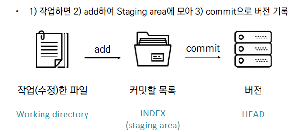
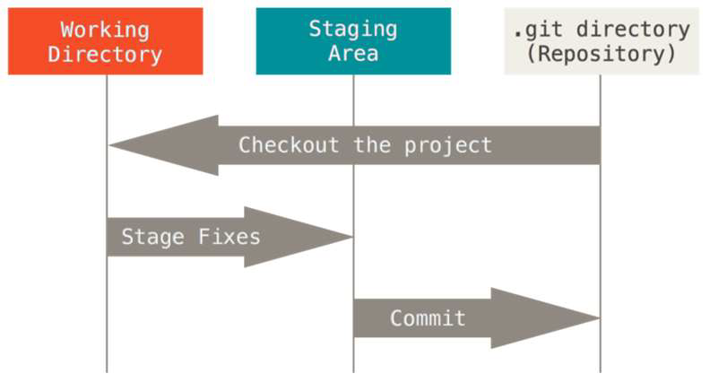
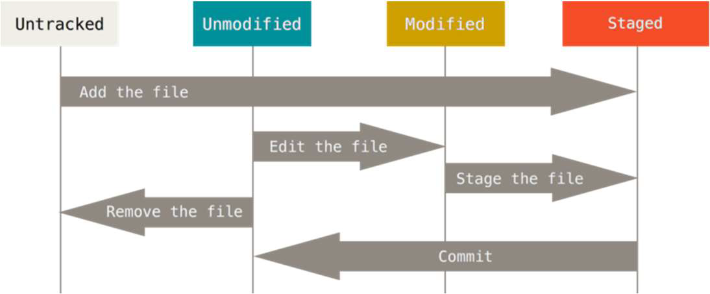

# git 과 git hub

## 버전관리

- git 은 버전관리 시스템이다.



- 일반적으로 버전에 따른 차이와 저장/삭제/복구가 어렵다.

- git을 통하여 버전에 차이와 수정이유(log,commit)를 남길수 있다.

- 다양한 버전관리 시스템이 존재, 대표적으로 git hub

- 버전관리의 예 : 크로미움(크람브라우저 오픈소스)

  

## 기초 CLI( Command Line Interface)

- 커맨드 라인 인터페이스 또는 명령어 인터페이스
- 모든것이 (문자열)명령기반이다.
- 대표적으로 유닉스셀(bash,sh)과 도스의 CMD가 있다

### CLI의 기초 명령어

- echo 특정 프로그램을 어떠한 인자와 함케 호출하도록 명령

~~~bash
echo 'hello world'
~~~

- pwd(print working directory) : 현재 디렉토리 출력
- cd (change directory) : 디렉토리 이동
- ls(list) : 목록 인자로 -al을 넣어 숨김파일도 볼 수 있다
- mkdir(make directory) : 디렉토리 생성
- touch : 파일의 날짜와 시간을 수정(0바이트 빈파일 생성)
- crtl + l 배쉬 화면 청소
- mv a b a를 b로 이름바꾸기


## GIT

- Git은 분산 버전관리 시스템으로 코드의 버전을 관리하는 도구
- 파일의 변경사항을 추적하고 여려 명의 사용자들간의 해당 파일 작업을 조율
- Git 의 기본흐름



### Git의 파일의 상태

- Tracked : 이전부터 git에 버전으로 관리되고 있는 파일
  - Unmodified : git status에 나타나지 않음
  - modified : 파일이 수적된 상태(add를 통해 staging area로)
  - staged : 수정한 파일을 곧 커밋할 것이라고 표시한 상태(commit  명령어로 저장소)
  - committed : 커밋이 된상태
- Untracked : 버전으로 관리된적 없는 파일(새로만든경우)

**기본흐름**


**파일라이프사이클**


### GIt의 기본 명령어

#### git init

- 특정 폴더를 git저장소(repository)를 만들어 git 관리
- 만들어진 git 폴더에 버전정보 기록


#### git add <file>

- working direcctory 상의 변경내용을 staging area 에 추가하기위해 사용
- untracked, modified 상태의 파일을 staged로 변경


#### git commit

- 기본형태 git commit -m '커밋메시지'
- staged 상태의 파일들을 커밋을 통해 버전으로 기록
- SHA-1 해시를 사용 40자 길이의 체크섬을 생성, 이를 통해 고유한 커밋을 표시
- 커밋 메시지는 변경사항을 나타낼 수 있도록 명확하게 작성해야함
- 커밋예시

```bash
$ git commit -m 'markdown210809'
[main 79440e1] markdown210809
 4 files changed, 0 insertions(+), 0 deletions(-)
 create mode 100644 markdown/md-images/KakaoTalk_20210809_165417653.jpg
 create mode 100644 markdown/md-images/image-20210809164247032.png
 create mode 100644 markdown/md-images/image-20210809164523262.png
 create mode 100644 markdown/md-images/image-20210809165638284.png
```

- Git은 데이터 파일 시스템의 스냅샷으로 관리하고 매우 크기가 작음


#### git status

- Git 저장송에 있는 파일의 상태를 확인하기 위하여 활용
  - Untracked - 커밋된적 없는 파일들
  - Changes not staged for commit - staged가 아닌 변경사항들(아직 wd)
  - Changes to be committed - staged 상태의 파일
  - Noting to commit, working tree clean 
- working directory 와 staging area 를 보는 명령어다
- 예시

```bash
$ git status
On branch main
Your branch is up to date with 'origin/main'.

Changes not staged for commit:
  (use "git add <file>..." to update what will be committed)
  (use "git restore <file>..." to discard changes in working directory)
        modified:   README.md

Untracked files:
  (use "git add <file>..." to include in what will be committed)
        git/
        markdown/md-images/

no changes added to commit (use "git add" and/or "git commit -a")
```


#### git log

- **현재 저장소에 기록된 커밋을 조회** 즉 버전을 조회
- 다양한 옵션을 통해 로그를 조회할수 있음
- log가 늘어나게 되면 다양한 방식으로 조회해야 한다


#### git config

- git hub에서 설정한 username으로 설정

~~~bash
git config —global user.name “username” 
~~~


- Github에서 설정한 email로 설정

```bash
git config —global user.email “my@email.com”
```


- 설정확인

~~~bash
git config -l
git config —global -l
git config user.name
~~~


- 설정 범위설정

```bash
$ git config --system ##시스템 의 모든 사용자와 모든저장소에 적용(관리자 권한)

$ git config --global ## 현재 사용자에게 적용되는 설정

$ git config --local ## 특정 저장소에만 적용되는 설정
```


### 원격저장소의 명령어(github)

#### remote

- remote 확인

```bash
$ git remote -v
origin  https://github.com/rhyou10/TIL.git (fetch)
origin  https://github.com/rhyou10/TIL.git (push)
```

- 기본적으로 origin을 사용한다
- remote 추가, 삭제, url 변경, 이름변경

```bash
$ git remote add <이름> <url> ##추가
$ git remote rm <이름> ##삭제
$ git remote set-url <이름> <url> ##url 변경
$ git remote rename <이름> <새이름> ##이름변경
```

- 여기서 origin은 원격저장소 이름이다. 다르게 써도 되지만 일반적으로 origin 쓴다 만약 다양한 원격저장소를 쓴다면 다른이름 가능하다.


#### push

- $ git push <원격저장소이름> <브랜치이름> 형태로 쓰인다

- git push(깃아 오리진에 master 브랜치를 푸시해라 )

```bash
$  git push origin master
$  git push -u origin master
```

- 한번 한 뒤 git push 뒤에 문장 생략된다
- master 보다는 main으로 사용하는것이 추세


####  clone

- 원격 저장소를 복제하여 가져옴

```bash
$ git clone <원격저장소주소>
```


#### git pull

- 원격 저장소로부터 변경된 내역을 받아와서 이력을 병합함

```bash
$ git pull <원격저장소이름> <브랜치이름>
```


