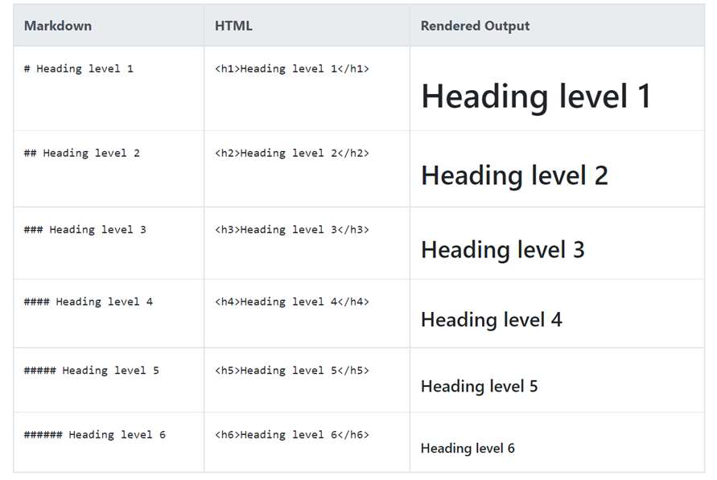
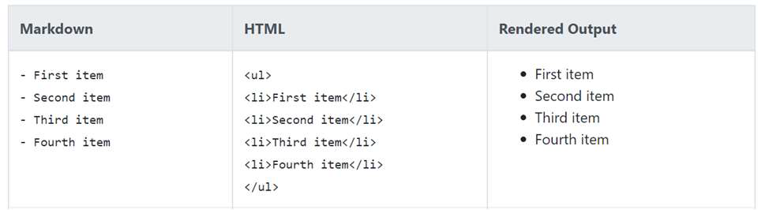
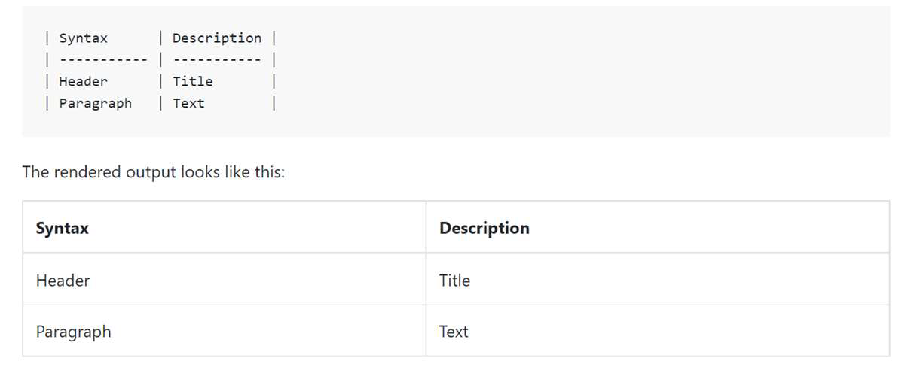

# 마크다운

## Markdown

### 1. 마크다운 특징 과 팁

- 텍스트 기반 가벼운 마크업 언어
- 최초 마크다운에 비해 확장된 문법(표, 주석)
- 마크다운 기반 다양한 웹 문서로 전환 가능하다


### 2. 마크다운 문법 - list





- #의 개수에 따라 H1~H6까지 표현가능
- -를 통해 정리 가능


### 3. 마크다운 문법  - Fenced code block

- 마크다운 내부에 코드를 적기위해 사용됨 

- 코드 블록에 특정언어 명시하여 Synax Highlighting 적용가능(일부환경 적용 x)

- 사용법 ` --> 백슬래쉬 3개를 적어 사용한다

  ``` python
  print('hello world')
  ```


### 4. 마크다운 문법 -lnline Code Block

- hi `hi` 
- 사용법 ` --> 백슬래쉬 1개를 적어 사용한다.


### 5. 마크다운 문법 -Link

- [문자열] (url) 을 통해 리크 작성가능
- ex > [네이버](www.naver.com)


### 6. 마크다운 문법 - 이미지

- ![문자열] (url) 을 통해 이미지 사용 가능
- ex -> 


### 7. 마크다운 문법 - Blockquotes(인용문)

- (>) 을 통해 인용문 작성()를 뺴고 쓴다

- > 인용문 예시


### 8. 마크다운 문법 - Table(표)



- 위와 같이 표현할 수 있으나 프로그램에 따라 표 서식이 내장되어 있는경우도 있다


### 9. 마크다운 문법 - Text 강조

- 굵게(bold), 기울임(italic) 을 통해 특정글자들을 강조 * ** 을 활용
- *hi*  **hi**


### 10. 마크다운 문법 - 수평선

- -*_를 3개이상 작성시 수평선이 생긴다

---


## 연관 사이트

[GitHub Flavored Markdown](https://github.github.com/gfm/)

[Mastering Markdown](https://guides.github.com/features/mastering-markdown)

[Markdown Guide](https://www.markdownguide.org/) cheet sheet 활용에 좋다

